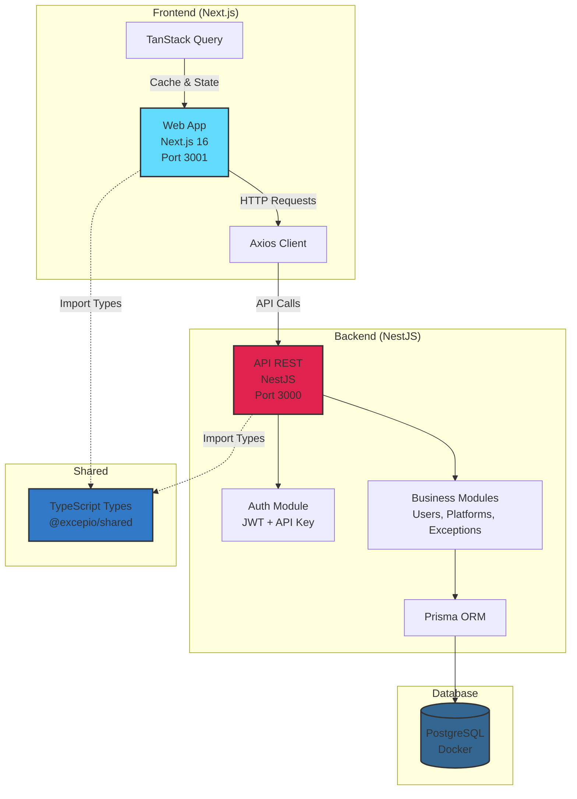
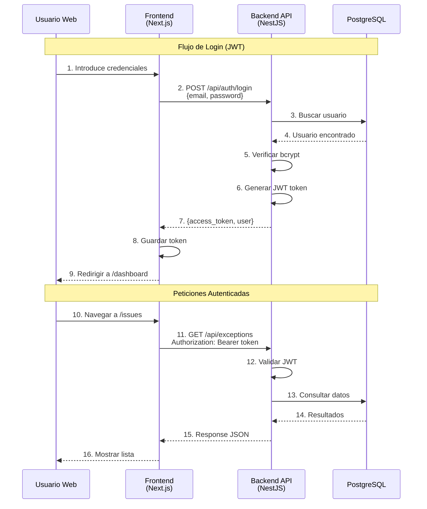
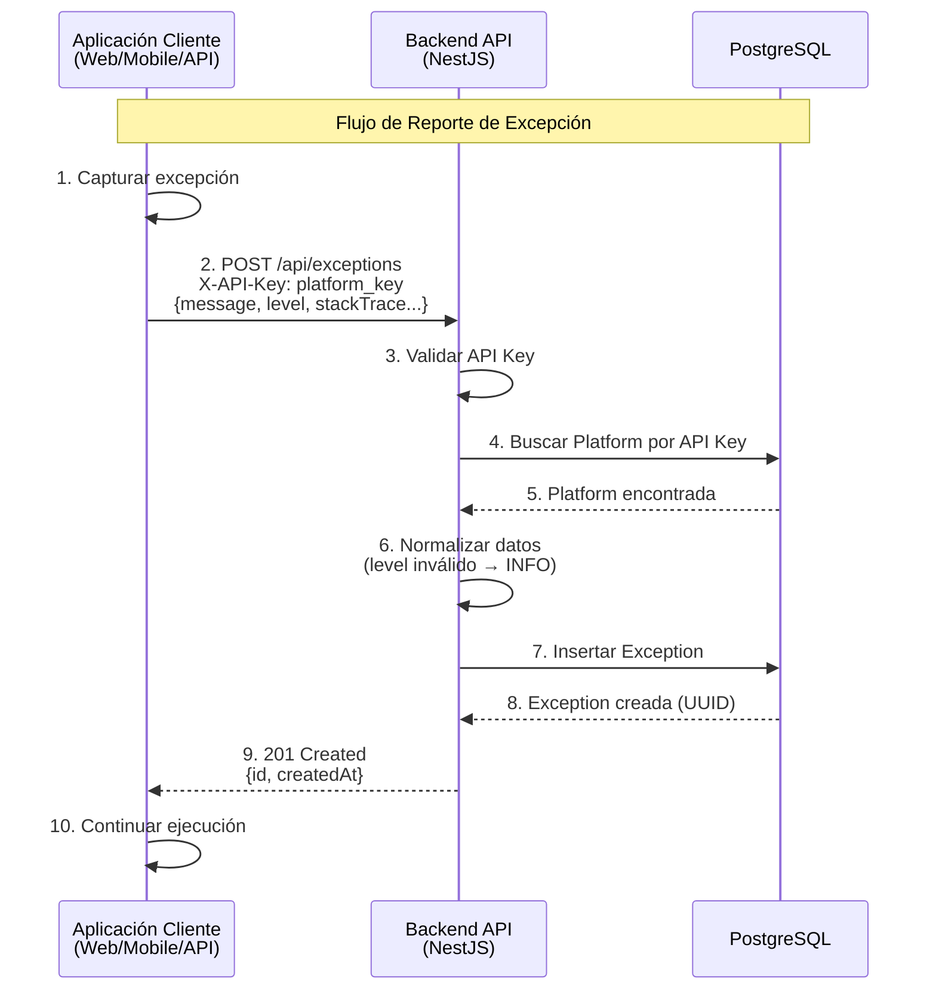
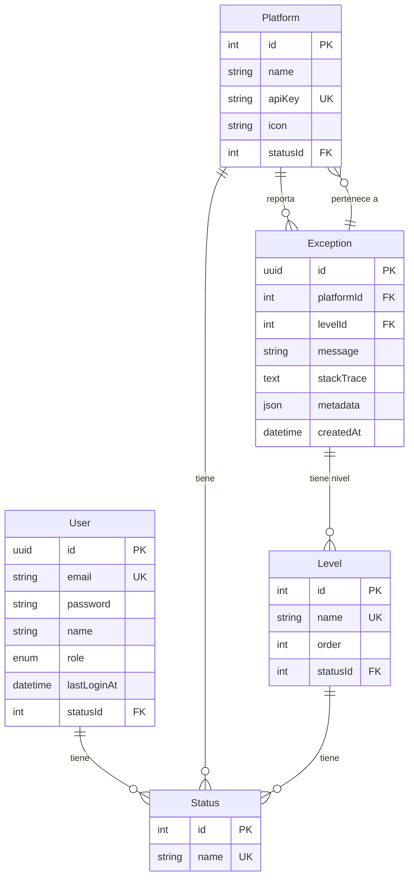

# Excepio


Sistema de monitorización y gestión de excepciones para aplicaciones multiplataforma.

---

## 📑 Tabla de Contenidos

- [📖 Descripción General](#-descripción-general)
- [✨ Características Principales](#-características-principales)
- [🏗️ Arquitectura](#️-arquitectura)
- [🛠️ Stack Tecnológico](#️-stack-tecnológico)
- [📋 Requisitos Previos](#-requisitos-previos)
- [🚀 Instalación y Configuración](#-instalación-y-configuración)
- [🔑 Credenciales de Prueba](#-credenciales-de-prueba)
- [📁 Estructura del Proyecto](#-estructura-del-proyecto)
- [🧪 Testing](#-testing)
- [🌍 Idiomas Soportados](#-idiomas-soportados)
- [📚 Documentación Adicional](#-documentación-adicional)

---

## 📖 Descripción General

**Excepio** es un sistema completo de monitorización y gestión de excepciones diseñado para ayudar a equipos de desarrollo a rastrear, analizar y resolver errores en aplicaciones multiplataforma.

### Problema que resuelve

Centraliza el registro de excepciones desde múltiples fuentes (web, mobile, APIs) en una única plataforma, facilitando:
- Detección temprana de errores en producción
- Análisis de tendencias y patrones de fallos
- Priorización de bugs por severidad e impacto
- Colaboración entre equipos mediante gestión de usuarios y roles

### Casos de uso principales

- **Desarrollo**: Monitorizar errores durante el ciclo de vida del desarrollo
- **QA/Testing**: Identificar y reproducir bugs reportados automáticamente
- **DevOps**: Alertas y análisis de incidencias en producción
- **Product Management**: Dashboard ejecutivo con métricas de calidad

### Características destacadas

- 🔐 **Doble autenticación**: JWT para usuarios web + API Keys para aplicaciones
- 📊 **Dashboard analítico**: Estadísticas en tiempo real con gráficos interactivos
- 🌍 **Multiidioma**: Interfaz en Català, Español e English
- 🎨 **Diseño moderno**: UI responsive con tema claro/oscuro
- 🔍 **Búsqueda avanzada**: Filtros por plataforma, severidad, fecha, metadata y más
- 👥 **Control de acceso**: RBAC con roles de Administrador y Usuario

---

## ✨ Características Principales

### 🔐 Autenticación y Autorización

- **JWT (JSON Web Tokens)** para usuarios web con email/password
- **API Keys** únicas por plataforma para reporte automático de excepciones
- **Control de acceso basado en roles (RBAC)**:
  - **Administrador**: Gestión completa de usuarios, plataformas y excepciones
  - **Usuario**: Visualización de excepciones y plataformas (solo lectura)

### 📊 Dashboard y Análisis

- **Total de excepciones** con comparación temporal (período actual vs anterior)
- **Gráfico de series temporales** con agrupación automática por hora/día
- **Distribución por plataforma** (pie chart) con porcentajes
- **Excepciones agrupadas** por mensaje para identificar errores recurrentes
- **Selector de rango de fechas** con presets (7, 30, 90 días) y personalizado

### 🐛 Gestión de Excepciones

- **Reporte vía API REST** con validación automática y normalización de datos
- **Listado avanzado** con filtros por plataforma, severidad, fechas, búsqueda de texto
- **Vista detallada** que incluye:
  - Stack trace con formato legible
  - Metadata en formato JSON
  - Información contextual (URL, user agent, app version)
  - Historial de ocurrencias (últimas 10 + gráfico por día)
  - Contador de usuarios afectados
- **Paginación** y estado persistente en sesión

### 👥 Gestión de Usuarios y Plataformas (Admin)

**Usuarios**:
- CRUD completo (crear, editar, eliminar)
- Reset de contraseñas por parte del administrador
- Activación/desactivación (borrado lógico)
- Protección contra auto-eliminación

**Plataformas**:
- CRUD completo con asignación manual de IDs
- Generación automática de API Keys
- Regeneración de claves con invalidación inmediata
- Activación/desactivación (borrado lógico)
- Soporte para iconos personalizados

### 🌍 Interfaz Multiidioma

- **3 idiomas**: Català, Español (por defecto), English
- **Detección automática**: Cookie → Accept-Language → Default
- **Persistencia** mediante cookie `NEXT_LOCALE`
- **Selector visual** con banderas SVG en la cabecera

### 📱 Diseño Responsive

- **Mobile-first**: Optimizado para dispositivos móviles
- **Adaptativo**: Tablas en desktop, cards en mobile
- **Navegación dual**: Sidebar en desktop, bottom bar en mobile
- **Tema claro/oscuro** con detección de preferencia del sistema

---

## 🏗️ Arquitectura

Monorepo con **Frontend** (Next.js) y **Backend** (NestJS) desplegados en servidores independientes. La comunicación entre aplicaciones se realiza exclusivamente mediante **HTTP (REST API)**, sin importaciones directas de código entre apps.

### Diagrama de Arquitectura del Sistema



### Flujo de Autenticación (JWT)



### Flujo de Reporte de Excepciones (API Key)



### Modelo de Datos



> **Más información**: Ver [ARCHITECTURE.md](./docs/ARCHITECTURE.md) para detalles completos sobre decisiones técnicas y patrones de diseño.

---

## 🛠️ Stack Tecnológico

| Capa | Tecnología |
|------|------------|
| **Frontend** | Next.js 16 (App Router) + TypeScript + TanStack Query + Tailwind CSS |
| **Backend** | NestJS + Passport.js (JWT) + bcrypt |
| **Base de datos** | PostgreSQL 15 + Prisma ORM |
| **Testing** | Vitest + Testing Library + Playwright (E2E) |
| **i18n** | next-intl (Català, Español, English) |
| **Monorepo** | pnpm workspaces |
| **Documentación API** | Swagger/OpenAPI |
| **Containerización** | Docker + Docker Compose |

---

## 📋 Requisitos Previos

Antes de comenzar, asegúrate de tener instalado:

- **Node.js** >= 20.0.0
- **pnpm** >= 9.0.0
- **Docker** (para PostgreSQL)
- **Git** (opcional, para clonar el repositorio)

---

## 🚀 Instalación y Configuración

### 1. Clonar el repositorio (si aplica)

```bash
git clone <url-del-repositorio>
cd excepio
```

### 2. Instalar dependencias

```bash
pnpm install
```

Este comando instalará las dependencias de todos los workspaces (api, web, shared).

### 3. Configurar variables de entorno

#### Backend (`apps/api/.env`)

Copia el archivo de ejemplo y ajusta los valores si es necesario:

```bash
cp apps/api/.env.example apps/api/.env
```

Contenido del `.env`:

```env
DATABASE_URL="postgresql://postgres:gzQFyXv95B2@Xe@localhost:5432/excepio?schema=public"
CORS_ORIGIN="http://localhost:3001"
NODE_ENV="development"
JWT_SECRET="your-super-secret-jwt-key-change-in-production"
```

#### Frontend (`apps/web/.env.local`)

Crea el archivo con la URL de la API:

```bash
echo 'NEXT_PUBLIC_API_URL="http://localhost:3000/api"' > apps/web/.env.local
```

### 4. Levantar la base de datos

Inicia PostgreSQL en Docker:

```bash
pnpm db:up
```

Esto ejecutará `docker compose up -d postgres` y creará un contenedor con PostgreSQL en el puerto `5432`.

### 5. Ejecutar migraciones y seed

Aplica las migraciones de Prisma y carga los datos iniciales:

```bash
pnpm --filter @excepio/api exec prisma migrate dev
pnpm --filter @excepio/api exec prisma db seed
```

El seed creará:
- 4 estados (PENDING, ACTIVE, EXPIRED, DELETED)
- 5 niveles de severidad (DEBUG, INFO, WARNING, ERROR, FATAL)
- 5 plataformas de ejemplo (Web, WM, Android, iOS, API)
- 2 usuarios de prueba: 1 administrador (`admin@excepio.com`) y 1 usuario básico (`user@excepio.com`)
- 100 excepciones de prueba distribuidas en los últimos 30 días

### 6. Iniciar el proyecto

Inicia todos los servicios en modo desarrollo:

```bash
pnpm dev
```

Esto ejecutará tanto el backend como el frontend en paralelo.

### 7. Acceder a la aplicación

Una vez iniciados los servicios:

| Servicio | URL | Descripción |
|----------|-----|-------------|
| **Frontend** | http://localhost:3001 | Aplicación web (Next.js) |
| **API** | http://localhost:3000/api | API REST (NestJS) |
| **Swagger** | http://localhost:3000/api/swagger | Documentación interactiva de la API |
| **Prisma Studio** | `pnpm --filter @excepio/api exec prisma studio` | GUI para explorar la base de datos |

---

## 🔑 Credenciales de Prueba

Después de ejecutar las migraciones y el seed de la base de datos, puedes acceder a la aplicación con los siguientes usuarios:

### Usuario Administrador

| Campo | Valor |
|-------|-------|
| **Email** | `admin@excepio.com` |
| **Contraseña** | `Admin123!` |
| **Rol** | Administrador (acceso completo) |

**Permisos**: Gestión completa de usuarios, plataformas y excepciones. Puede crear, editar, eliminar y regenerar API Keys.

### Usuario Básico

| Campo | Valor |
|-------|-------|
| **Email** | `user@excepio.com` |
| **Contraseña** | `User123!` |
| **Rol** | Usuario (solo lectura) |

**Permisos**: Visualización de excepciones y plataformas. No puede gestionar usuarios ni modificar plataformas.

> **Nota**: El seed también crea 5 plataformas de ejemplo con sus respectivas API Keys. Puedes consultarlas en `/platforms` después de iniciar sesión, o directamente en Prisma Studio.

---

## 📁 Estructura del Proyecto

```
excepio/
├── apps/
│   ├── api/                      # Backend NestJS
│   │   ├── src/
│   │   │   ├── auth/             # Módulo de autenticación (JWT + API Key)
│   │   │   ├── user/             # Gestión de usuarios (CRUD, roles)
│   │   │   ├── platform/         # Gestión de plataformas (CRUD, API Keys)
│   │   │   ├── exception/        # Gestión de excepciones (reportes, filtros)
│   │   │   ├── stats/            # Estadísticas y analytics (dashboard)
│   │   │   ├── level/            # Niveles de severidad (DEBUG-FATAL)
│   │   │   ├── status/           # Estados (ACTIVE/DELETED)
│   │   │   ├── prisma/           # Cliente Prisma y servicio
│   │   │   ├── config/           # Configuración y validación de env vars
│   │   │   ├── health.controller.ts  # Health check endpoint
│   │   │   ├── app.module.ts     # Módulo raíz de NestJS
│   │   │   └── main.ts           # Punto de entrada (CORS + Swagger)
│   │   ├── prisma/
│   │   │   ├── schema.prisma     # Modelo de datos completo
│   │   │   ├── migrations/       # Migraciones de base de datos
│   │   │   └── seed.ts           # Datos iniciales (users, platforms, exceptions)
│   │   ├── test/
│   │   │   ├── unit/             # Tests unitarios (servicios, utilidades)
│   │   │   └── integration/      # Tests de integración (endpoints, DB)
│   │   └── package.json
│   │
│   └── web/                      # Frontend Next.js (App Router)
│       ├── src/
│       │   ├── app/              # Páginas y layouts (App Router)
│       │   │   ├── (auth)/       # Grupo de rutas: /login, /register
│       │   │   ├── (dashboard)/  # Grupo protegido: /dashboard, /issues, /users, /platforms
│       │   │   ├── layout.tsx    # Layout raíz con providers
│       │   │   └── page.tsx      # Página principal (redirect)
│       │   ├── components/
│       │   │   ├── ui/           # Componentes UI genéricos (shadcn/ui)
│       │   │   ├── issues/       # Componentes de excepciones
│       │   │   ├── dashboard/    # Componentes del dashboard
│       │   │   └── layout/       # Header, sidebar, navigation
│       │   ├── contexts/         # React Contexts (AuthContext)
│       │   ├── hooks/            # Custom hooks (useAuth, useIssues, etc.)
│       │   ├── i18n/             # Configuración de next-intl
│       │   ├── lib/
│       │   │   ├── api-client.ts # Cliente Axios con interceptors
│       │   │   ├── auth-storage.ts # Gestión de tokens JWT
│       │   │   └── utils.ts      # Utilidades generales
│       │   └── providers/        # Providers (TanStack Query, Theme)
│       ├── messages/             # Traducciones i18n
│       │   ├── ca.json           # Català
│       │   ├── es.json           # Español (por defecto)
│       │   └── en.json           # English
│       ├── e2e/                  # Tests E2E con Playwright
│       │   ├── auth.spec.ts
│       │   ├── dashboard.spec.ts
│       │   ├── issues.spec.ts
│       │   └── issue-detail.spec.ts
│       ├── test/                 # Tests unitarios e integración
│       └── package.json
│
├── packages/
│   ├── shared/                   # Tipos TypeScript compartidos
│   │   ├── src/
│   │   │   ├── auth.dto.ts       # DTOs de autenticación (login, register)
│   │   │   ├── user.dto.ts       # DTOs de usuarios (CRUD)
│   │   │   ├── platform.dto.ts   # DTOs de plataformas (CRUD)
│   │   │   ├── exception.dto.ts  # DTOs de excepciones (create, filter)
│   │   │   ├── stats.dto.ts      # DTOs de estadísticas (analytics)
│   │   │   ├── level.dto.ts      # DTOs de niveles
│   │   │   ├── status.dto.ts     # DTOs de estados
│   │   │   └── index.ts          # Barrel exports
│   │   └── package.json
│   ├── typescript-config/        # Configuraciones TypeScript compartidas
│   └── eslint-config/            # Configuraciones ESLint compartidas
│
├── docs/                         # Documentación adicional
│   ├── ARCHITECTURE.md           # Arquitectura y decisiones técnicas
│   ├── DATABASE.md               # Modelo de datos y schema detallado
│   ├── SCRIPTS.md                # Lista completa de comandos disponibles
│   └── CONTRIBUTING.md           # Guía de desarrollo y buenas prácticas
│
├── docker-compose.yml            # PostgreSQL en Docker
├── pnpm-workspace.yaml           # Configuración del monorepo
├── AGENTS.md                     # Guía para agentes IA (TDD, convenciones)
└── README.md                     # Este archivo
```

### Convenciones del Proyecto

- **Path aliases**: Imports absolutos (`@app/*`, `@components/*`, `@lib/*`, etc.) en lugar de relativos (`../../`)
- **Comunicación Frontend-Backend**: Exclusivamente HTTP (REST API), sin importaciones directas entre apps
- **Tipos compartidos**: Todos los DTOs viven en `@excepio/shared` e importados por ambas apps
- **Borrado lógico**: Usuarios y plataformas se marcan como `DELETED` (no se eliminan físicamente)
- **TDD**: Escribir tests primero, luego implementación (ver `AGENTS.md`)

---

## 🧪 Testing

El proyecto implementa una estrategia de testing en tres niveles:

### Tests Unitarios e Integración (Vitest)

```bash
# Ejecutar todos los tests (API + Web)
pnpm test

# Solo tests del backend
pnpm --filter @excepio/api test

# Solo tests del frontend
pnpm --filter @excepio/web test

# Tests con cobertura
pnpm --filter @excepio/api test:coverage
pnpm --filter @excepio/web test:coverage

# Modo watch (re-ejecuta al guardar cambios)
pnpm --filter @excepio/api test:watch
```

### Tests E2E (Playwright)

**Requisito previo**: API y Web deben estar corriendo en `localhost:3000` y `localhost:3001`

```bash
# 1. Levantar servicios en terminales separadas
pnpm --filter @excepio/api dev
pnpm --filter @excepio/web dev

# 2. Ejecutar tests E2E (en otra terminal)
pnpm --filter @excepio/web test:e2e

# Con interfaz visual interactiva
pnpm --filter @excepio/web test:e2e:ui

# Ver navegador durante la ejecución
pnpm --filter @excepio/web test:e2e:headed

# Ver reporte HTML de la última ejecución
pnpm --filter @excepio/web exec playwright show-report
```

### Suites E2E Disponibles

| Archivo | Cobertura |
|---------|-----------|
| `auth.spec.ts` | Autenticación (login, logout, protección de rutas) |
| `dashboard.spec.ts` | Dashboard y navegación principal |
| `issues.spec.ts` | Listado de excepciones, filtros, paginación |
| `issue-detail.spec.ts` | Vista detallada (header, stacktrace, metadata, occurrences) |

> **Más información**: Ver [SCRIPTS.md](./docs/SCRIPTS.md) para la lista completa de comandos disponibles.

---

## 🌍 Idiomas Soportados

La interfaz web está disponible en tres idiomas con soporte completo de internacionalización:

| Idioma | Código | Estado |
|--------|--------|--------|
| **Català** | `ca` | ✅ Completo |
| **Español** | `es` | ✅ Completo (por defecto) |
| **English** | `en` | ✅ Completo |

### Detección de Idioma

El sistema detecta el idioma en el siguiente orden de prioridad:

1. **Cookie `NEXT_LOCALE`**: Idioma seleccionado manualmente por el usuario
2. **Header `Accept-Language`**: Preferencia del navegador
3. **Idioma por defecto**: Español (`es`)

El selector de idioma está disponible en la cabecera de la aplicación y persiste la preferencia mediante cookie.

### Archivos de Traducción

- `apps/web/messages/ca.json` - Traducciones en catalán
- `apps/web/messages/es.json` - Traducciones en español
- `apps/web/messages/en.json` - Traducciones en inglés

> **Nota para desarrolladores**: Al agregar nuevos textos visibles, asegúrate de añadir las traducciones en los 3 archivos. Los tests de integración verifican la consistencia entre idiomas.

---

## 📚 Documentación Adicional

Para información más detallada sobre aspectos específicos del proyecto, consulta la documentación en la carpeta `/docs`:

| Documento | Descripción |
|-----------|-------------|
| [**ARCHITECTURE.md**](./docs/ARCHITECTURE.md) | Arquitectura completa, decisiones técnicas, flujos de autenticación, path aliases |
| [**DATABASE.md**](./docs/DATABASE.md) | Modelo de datos detallado, relaciones, diagramas de tablas, credenciales de BD |
| [**SCRIPTS.md**](./docs/SCRIPTS.md) | Lista completa de comandos disponibles (dev, build, test, prisma, etc.) |
| [**CONTRIBUTING.md**](./docs/CONTRIBUTING.md) | Guía de desarrollo, errores comunes a evitar, mejores prácticas |
| [**AGENTS.md**](./AGENTS.md) | Guía para agentes IA: TDD, convenciones del proyecto, modo de trabajo |

### Recursos Externos

- **Documentación API**: http://localhost:3000/api/swagger (después de iniciar el backend)
- **Prisma Studio**: `pnpm --filter @excepio/api exec prisma studio` (GUI para la base de datos)

---

